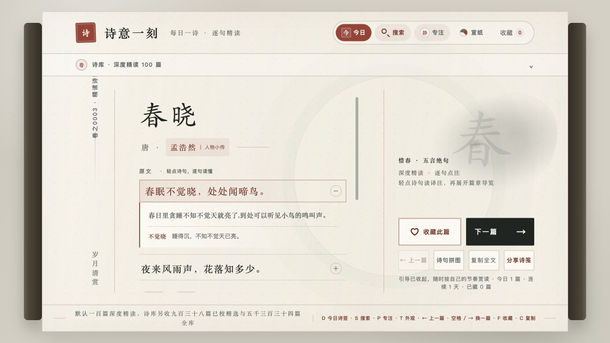

# 诗意一刻

“诗意一刻”是一款离线优先的诗词精读与记忆工具，支持逐句译注、主动回想、诗句拼图和间隔复习。

## 在线体验

## 核心功能

| 功能 | 说明 |
| --- | --- |
| 逐句精读 | 100 篇人工校订的深度精读，轻点原文即可查看白话译文、重点难词与篇章导览 |
| 回想复习 | 通过逐句补全主动回想，按学习情况安排间隔复习；进度只保存在本机 |
| 诗句拼图 | 将彩色不规则拼片嵌入二维拼图板，支持鼠标、触控笔、手指拖放及键盘操作 |
| 诗库搜索 | 内置 5334 篇诗词和 928 位作者资料，可按朝代、作者、主题及收藏筛选和搜索 |
| 阅读分享 | 提供简繁切换、专注模式、收藏、阅读统计与高清诗词分享图，扩展运行时无需联网 |

## 内容与许可

### 内容来源

| 来源 | 主要用途 | 许可与说明 |
| --- | --- | --- |
| Codex Sites“诗意一刻”第 4 版 | 项目初始页面与诗词译文数据 | 开放语料沿用原站标注 |
| [chinese-poetry 开放数据库](https://github.com/chinese-poetry/chinese-poetry) | 《诗经》《楚辞》原文、宋词正文及部分作者资料 | MIT License |
| [yht050511/gushiwen 开放数据](https://github.com/yht050511/gushiwen) | 多朝代诗词原文与白话译文 | MIT License |
| [Papersnake/gushiwen 数据集](https://huggingface.co/datasets/Papersnake/gushiwen) | 先秦白话译文补充与交叉核对 | CC0-1.0 |
| [中文维基百科](https://zh.wikipedia.org/) | 作者资料及《宋诗选注》选目线索 | 改编内容保留 CC BY-SA 4.0 署名、版本链接与改动说明 |
| [opencc-js](https://github.com/nk2028/opencc-js) | 界面与诗词内容的本地繁简转换 | 随项目本地打包，运行时不访问外部服务 |

100 篇精读的背景、难词释义与章法导览由本项目在核对原文、译文及通行古籍选本后重新撰写；
待校与 AI 辅助内容只在用户主动进入“全库广览”后展示。

完整署名与许可见[第三方声明](THIRD_PARTY_NOTICES.md)，来源及上游权利边界见
[内容授权审计](CONTENT_LICENSE_AUDIT.md)。审计不替代权利人书面许可或专业法律意见。

### 许可证

代码依照 [MIT License](LICENSE) 发布。诗词文本、译文及其来源信息以各数据记录中的标注为准。
